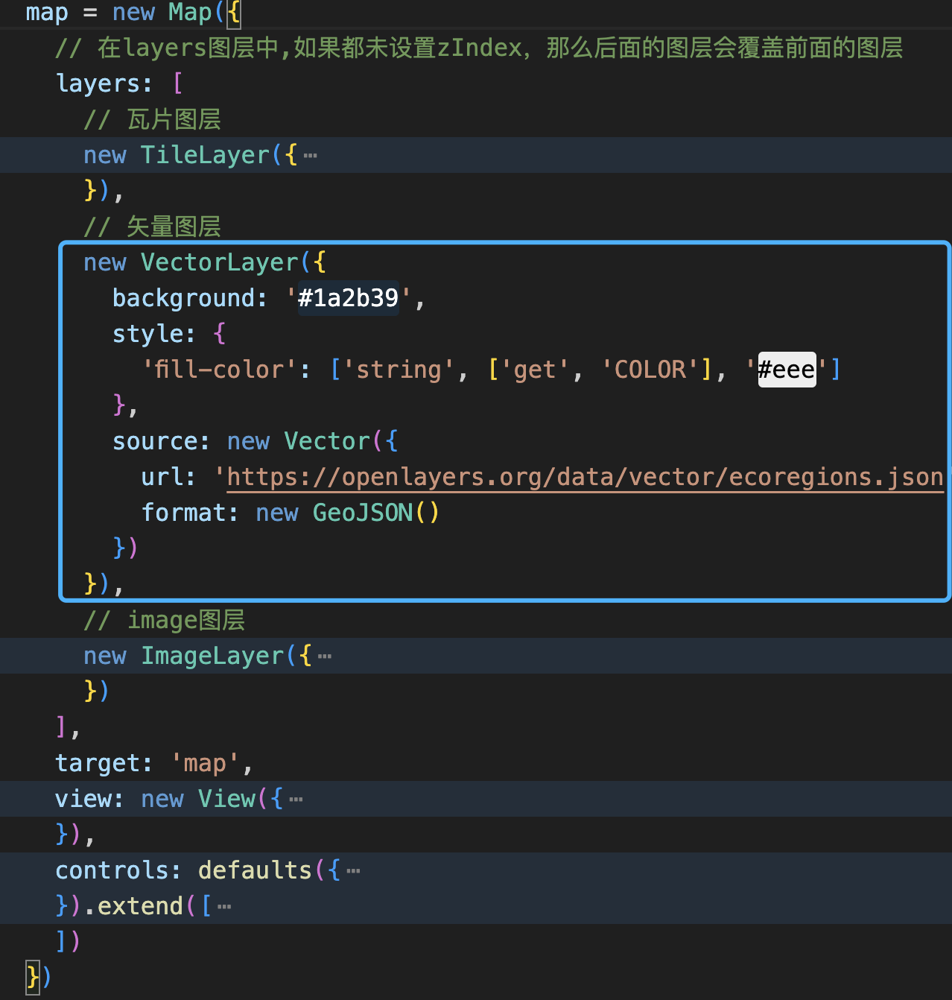

# openlayers

## openlayers的核心概念

### 地理坐标系

地理坐标系统是地球表面空间要素的定位参照系统。由 经度 和 纬度 定义。

### EPSG

EPSG 是大地基准面、空间参考系统、地球椭球体、坐标转换和相关度量单位的公共注册中心，它为每个坐标系都分配有一个编码。

#### WGS84

**WGS84**坐标系目前应用最为广泛的坐标系统，只要跟GPS定位相关，使用的都是**WGS84**坐标系，谷歌、OSM也用的**WGS84**坐标系，很多软件（QGIS、ARCGIS）、前端脚本库（leaflet、mapbox、openlayer），在没有特别声明的时候，默认数据使用是**WGS84**坐标。

**WGS84**坐标是一种地心坐标系，坐标原点为地球质心，它采用一个十分近似于地球自然形状的参考椭球作为描述和推算地面点位置和相互关系的基准面。(**EPSG编码是4326**)

> WGS84坐标也叫经纬高坐标系(经度(longitude)，纬度(latitude)和高度(altitude)LLA坐标系)。可以说是最为广泛应用的一个地球坐标系，它给出一点的大地纬度、大地经度和大地高度，而更加直观地告诉我们该点在地球中的位置，故又被称作经纬高坐标系。

其中：

1. 大地纬度是过用户点P的基准椭球面法线与赤道面的夹角。纬度值在-90°到+90°之间。北半球为正，南半球为负。
2. 大地经度是过用户点P的子午面与本初子午线之间的夹角。经度值在-180°到+180°之间。
   大地高度h是过用户点P到基准椭球面的法线距离，基准椭球面以内为负，以外为正。


由于我们项目中大多数都是使用经纬度,所以会将默认的投影系统(**EPSG3857**)更改为为**EPSG4326**


#### GCJ02

GCJ-02又称为火星坐标系，GCJ-02是由中国国家测绘局（G表示Guojia国家，C表示Cehui测绘，J表示Ju局）制订的地理信息系统的坐标系统。
它的中文名——国家测量局02号标准，它是一种对经纬度数据的加密算法，即加入随机的偏差。
GCJ-02以WGS-84为基础，使用混淆算法，在纬度和经度上都加入随机偏移，以提高国家安全。如果把WGS-84的点放在GCJ-02地图上，平均来说，会有一个大约300-500米的位置偏移。
GCJ-02只是一种坐标偏移标准（算法），它并不是一个坐标系，未被收录在EPSG中。
目前国内大部分地图底图（高德、腾讯）和矢量数据（图商的LBS服务和Android手机的定位数据）都使用的是GCJ02坐标系，GCJ02的加密算法非常精妙，地图底图和矢量数据在使用之前，需要将坐标系进行统一。

#### BD02

BD09属于百度地图坐标系，它是在标准经纬度的基础上进行GCJ-02加偏之后，再加上百度自身的加偏算法，也就是在标准经纬度的基础之上进行了两次加偏。BD09未被收录在EPSG中。

### 投影坐标系

投影坐标系统是以平面直角坐标系（x，y）表示地面点与坐标原点的距离，单位一般是 米。

#### 摩卡托投影

墨卡托投影是最常用的圆柱投影之一，并且通常以赤道为切线。经线以几何方式投影到圆柱面上，而纬线以数学方式进行投影。这种投影方式产生成 90 度的经纬网格。将圆柱沿任意一条经线“剪开”可以获得最终的圆柱投影。经线等间距排列，而纬线间的间距越靠近极点越大。此投影是等角投影，并沿直线显示真实的方向。在墨卡托投影中，等角航线、等方位线是直线，但大多数的大圆都不是直线。

墨卡托投影会使面积产生变形，赤道地区变化最小，南北两极的变形最大，但因为在南北回归线之间影响很少，而这是多数航线所在区域，所以被广泛用来编制地图。


#### web墨卡托投影

Web墨卡托投影是墨卡托投影的一种变体，被Web地图应用业界普遍采纳。Web 墨卡托坐标系也被称为 Google Web 墨卡托、球面墨卡托、WGS 84 Web 墨卡托和伪墨卡托。它是 web 地图和在线服务的事实标准。借助此坐标系，将使用基于球体的墨卡托投影版本对 WGS 84 基准面上定义的测地坐标进行投影。**_EPSG编号为3857_**,为ol默认使用的EPSG编号;

虽然Web墨卡托的公式是墨卡托的球面形式，但地理坐标必须得以WGS84椭球面基准获得。此差异会导致投影略微不符合正形投影

Web-Mercator投影坐标系是网络地图的投影坐标系，几乎所有的网络地图都使用这种投影，它的投影结果是正方形的，计算简单，切图方便。

## openlayers 层级


1. 一张Map是由很多Layer图组成
2. 一个Layer对应一个source矢量数据源
3. 一个source由很多Feature组成
4. Feature是Geometry和Style组成


## 构建基础地图


1. Map: 地图是一个可视化的容易,在其中现实地图内容
2. Layer: 图层是地图中显示的一个对立的**数据集**,openLayers是支持多种类型的图层,如图片图层(Image),矢量图层(Vector),瓦片图层(tile)
   1. Image:图片图层用于显示静态的图像数据
   2. Vector:矢量数据源,用于显示矢量数据,如:GeoJson,KML等
   3. Tile:瓦片数据源,用于显示瓦片数据,如:在线地图服务
3. Source: 是图层**数据的来源**,表示图层**显示的内容**
4. View:视图是地图的显示范围,包括地图中心点,缩放级别,显示角度等.
5. Controls:控件,分为基础控件与所有控件
6. Projection: 投影是一种将地理坐标映射到平面坐标系上的方法,OL支持多种投影系统,如:WGS 84, web Mercator
7. Feature: 特征是地图上一个独立的显示对象,如:点,线,面
8. Style: 控制特征的显示样式与方法

## 地图控件

ol.control是地图控件API，它提供了默认的地图控件，如果你希望自定义控件，也可以通过API实现。

```javascript
import { defaults } from 'ol/control/defaults.js'
```


控件总类如下


## 图层

OpenLayer中，图层（Layer）根据API方法划分，分为三种类型图层：瓦片图层（Tile）、图片图层(Image)、矢量图层（Vector）。

OpenLayers地图数据通过图层（Layer）进行组织渲染，然后通过数据源（Source）设置具体的地图数据来源。**Source和Layer是一对一的关系**，有一个Source，必然需要一个Layer，然后把Layer添加到Map上，就可以显示出来。

### Tile瓦片

地理坐标系是以地球质心为坐标原点，通过经度、纬度、高度三个坐标轴，描述和推算地面点位置关系。而投影坐标系，根据投影方式将地理坐标系投影到平面上，所以也称平面坐标系。地理坐标系单位是度，投影坐标系单位是米。

地理坐标系经过墨卡托投影，地图成为一张平面地图。在Web端页面，由于既要展示宏观信息，也要展示微观信息，所以对这张地图进行等级切分。

在最高级（zoom=0），信息最少，只用一张256x256像素的一张图片就可以；在下一级（zoom=1），信息量变多，用一张512x512像素的图片表示；以此类推，级别越低的像素越高。称为瓦片（Tile）。

对每张图片，我们将其切分为单张256x256图片，称为瓦片（Tile）。这样，在最高级（zoom=0）时，只有一个瓦片；在下一级（zoom=1）时有4个瓦片；在下一级（zoom=2）时有16个瓦片，以此类推。这就像一个金字塔结构。


#### source

ol.source.Tile最为复杂，因为多个服务提供商，多种标准等诸多原因，导致要支持世界上大多数的瓦片数据，就需要针对这些差异提供不同的Tile数据源支持。

1. **ol.source.Tile**：Abstract base class。通常仅用于创建子类，不在应用程序中实例化；
2. **ol.source.UrlTile**：提供基于http网络，划分为瓦片网格的瓦片基类数据源；
3. [**ol.source.DataTile**](https://openlayers.org/en/v8.2.0/examples/data-tiles.html)：支持数据源为数组类型瓦片数据；
4. [**ol.source.UTFGrid**](https://openlayers.org/en/v8.2.0/examples/utfgrid.html)：支持TileJSON格式加载的UTFGrid交互数据的图层源；
5. [ol.source.XYZ](https://openlayers.org/en/v8.2.0/apidoc/module-ol_source_XYZ-XYZ.html)：支持各平台，XYZ格式的URL的瓦片数据（谷歌、高德、百度、Arcgis online等服务平台）；
6. [ol.source.TileArcGISRest](https://openlayers.org/en/v8.2.0/apidoc/module-ol_source_TileArcGISRest-TileArcGISRest.html)：支持Arcgis Server的Rest服务瓦片；
7. [ol.source.OSM](https://openlayers.org/en/v8.2.0/apidoc/module-ol_source_OSM-OSM.html)：支持 OpenStreetMap；
8. [ol.source.BingMaps](https://openlayers.org/en/v8.2.0/apidoc/module-ol_source_BingMaps-BingMaps.html)：支持 必应地图；
9. [ol.source.OGCMapTile](https://openlayers.org/en/v8.2.0/apidoc/module-ol_source_OGCMapTile-OGCMapTile.html)：支持OGC地图瓦片服务；
10. [ol.source.WMTS](https://openlayers.org/en/v8.2.0/apidoc/module-ol_source_WMTS-WMTS.html)：支持WMTS数据格式瓦片服务；
11. [ol.source.TileWMS](https://openlayers.org/en/v8.2.0/apidoc/module-ol_source_wms.html)：支持WMS数据格式瓦片服务；
12. [ol.source.Zoomify](https://openlayers.org/en/v8.2.0/apidoc/module-ol_source_Zoomify-Zoomify.html)：Zoomify格式的瓦片数据的层源（支持Zoomify和Internet Imaging协议）;
13. [ol.source.VectorTile](https://openlayers.org/en/v8.2.0/apidoc/module-ol_source_VectorTile-VectorTile.html)：支持矢量瓦片服务；（尽管是矢量，但是还是划入Tile数据源）
14. [ol.source.TileJSON](https://openlayers.org/en/v8.2.0/apidoc/module-ol_source_TileJSON-TileJSON.html)：支持TileJSON格式瓦片数据；


### Image图片

> 可用于任意范围和分辨率的服务器渲染图像

Image图层相比较Tile图层，Image对应的是一整张大图片，而不像瓦片那样很多张小图片，从而无需切片，也可以加载一些地图，适用于一些小场景地图。

#### source

1. **ol.source.Image**：Base class for sources providing a single image；
2. [ol.source.ImageArcGISRest](https://openlayers.org/en/v8.2.0/apidoc/module-ol_source_ImageArcGISRest-ImageArcGISRest.html)：支持Arcgis Server的Rest服务图片；
3. ol.source.ImageCanvas：支持添加Canvas图层作为图片；示例
4. ol.source.ImageMapGuide：支持Mapguide 服务器提供的图片；
5. ol.source.ImageStatic：支持静态图片；
6. ol.source.ImageWMS：支持WMS服务图片；
7. ol.source.Raster：光栅；（这个不知道怎么用）


### Vector矢量

瓦片、图片与矢量相比较，前两个基本就是图片，后者主要是点、线、面等数据集合。

1. 点数据可直接用坐标值描述，每个点是由单独的X,Y坐标定义的。
2. 线数据可用均匀或不均匀间隔的顺序坐标链来描述，线是一系列（至少2个）相连的折点或点的集合。
3. 面状数据（或多边形数据）可用边界线来描述，面是由3个或以上的折点组成的连续封闭图形。

常用的矢量数据格式有GeoJSON、TopoJSON、KML、GML、shapfile等。ol.source.Vector类是矢量数据源基类，为矢量图层ol.layer.Vector类提供具体的数据来源，包括直接组织或读取的矢量数据、远程数据源的矢量数据（即通过url设置数据源路径）。

#### source

1. [**ol.source.Vector**](https://openlayers.org/en/v8.2.0/apidoc/module-ol_source_Vector-VectorSource.html)：提供矢量图层的要素来源；（这里的要素我们会在后面文章说道）
2. [ol.source.Cluster](https://openlayers.org/en/v8.2.0/apidoc/module-ol_source_Cluster-Cluster.html)：对矢量数据进行聚合的图层源；(聚合，在后篇文章会使用)



## 点标记

OpenLayer中点标记（Marker）属于矢量图形，即矢量点。GIS地图上，日常开发上图的点、线、面、几何体都属于矢量图形

OpenLayer中，点标记创建需要 **Feature**、**Geometry**、**Style**三者共同组合完成。**Feature**作为点标记的实体，**Geometry**创建几何体（点、线、圆、多边形），**Style**创建样式（颜色、粗细、文本等）.点标记创建完成后，需要添加到矢量图层.

### Feature

```javascript
// 创建要素对象
const Feature = new ol.Feature({
  // 创建geometry
  geometry: new ol.geom.Point([116.39, 39.91])
})
```

### Geometry

Geometry 总类

1. ol/geom/Geometry：抽象基类
2. ol.geom.Circle：圆形几何
3. ol.geom.LineString：线
4. ol.geom.LinearRing：线性环几何。只用作多边形的一部分; （无法单独使用）；
5. ol.geom.MultiLineString：多线
6. ol.geom.MultiPoint：多点
7. ol.geom.MultiPolygon：多个多边形
8. ol.geom.Point：点几何
9. ol.geom.Polygon：多边形几何

```javascript
// 创建多边形 polygon
const points = [
  [
    [121.478815, 32.24161],
    [120.160318, 31.293255],
    [118.79129166, 32.06046152],
    [121.478815, 32.24161]
  ]
]
var feature = new ol.Feature({
  geometry: new ol.geom.Polygon(points)
})
```

### Style

1. ol.style.Style：矢量要素渲染样式的容器；
2. ol.style.Fill：设置矢量要素的填充样式；
3. ol.style.Icon：设置矢量要素的icon样式；
4. ol.style.Text：设置矢量要素的文本样式；
5. ol.style.Circle：设置矢量要素的圆形样式；
6. ol.style.Stroke：设置矢量要素的描边样式；
7. ol.style.RegularShape：设置矢量要素的常规形状样式；


## 覆盖物Overlay

我们也可以通过覆盖物（Overlay）来创建点标记，不过这个要看开发场景，如果数据量巨大，推荐使用矢量点标记，反之覆盖物点标记也可以。

ol.Overlay是覆盖物API，主要用途就是在地图之上覆盖DOM元素，作为弹窗、提示窗、标注信息等，通过给定的经纬度，它会固定在对应的点位上，移动地图或拖动地图，覆盖物（Overlay）与地图的相对位置不变。

覆盖物（Overlay）的主体是DOM元素节点，移动地图或拖动地图，主体会伴随相对位置不变；
ol.Overlay覆盖物（Overlay）也可用来创建点标记、文本等；


> 由上述代码可看出,覆盖物的显示信息与样式,取决于dom元素的内容与样式.
